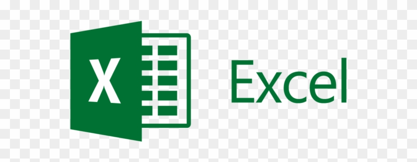

# Hello, folks! 

  
    
  <samp>
I'm Himanshu ,Currently i am working as ETL Developer in Aon Consulting. I have  2 years of experience in field of Data Analytics,SQL,Python,Excel and Tableau 
.I have worked closely with clients from industries like Insurance ,Finance and Healthcare domain. I am passionate about empowering business decisions through data analytics.
    
    
     
  </samp>

  
 
<!--Text-->
 <!--   -->

### 💡 My Skills :rocket:
- ETL development
- Data preparation, quality assurance, and analysis
- Dashboard development and reporting
- Exploratory data analysis

### 🛠️ My Tools
- Databases: SQL (SQL Server)
- ETL Tools: Python,Actian Dataconnect, Excel
- Visualisation: Tableau ,Power BI

 

### What I always play with

 
   
  
   
  

 

***
- 🌱 I’m currently working at Aon Consulting in Data Analytics Team.
- 👯 I’m looking for Data Analyst/Business Analyst Roles
-  💬 Ask me about Data Analytics
- ⚡ Fun fact: I Love Reading , Playing Cricket and a bunch of Video Games

### Connect with me :smiley:

<!-- Actual text -->

<!-- Icons -->

<!-- Links to your social media accounts -->

