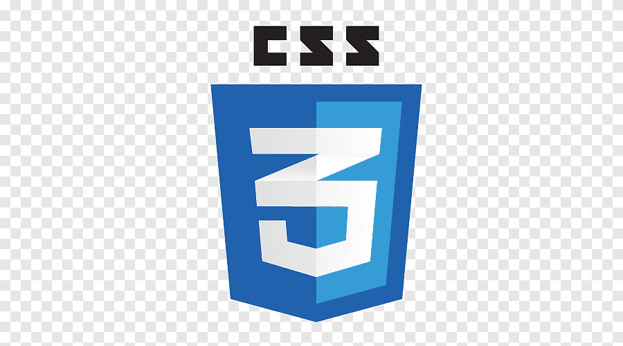
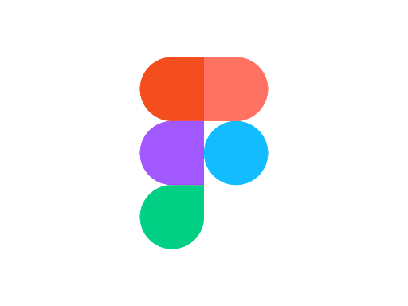

# Hello, folks! 

  
    
  <samp>
I'm Himanshu ,Currently a Btech Final year student at NorthCap University. I am an App Developer ,Web Designer & Web Developer from Gurugram, India. I love to design and develop apps websites, landing pages and applications .. 
    
    
     
  </samp>

  
    

### Programming Languages  :rocket:
| | |  ||  | |
|:---:|:---:|:---:|:---:|:---:|:---:|

### Tools :fire:
|| |    |  | | |
|:---:|:---:|:---:|:---:|:---:|:---:|

- 🔭 I’m currently working on Find Your TeamMates App
- 🌱 I’m currently learning Flutter,NodeJS,React.
- 👯 I’m looking to collaborate on Android and web developement
-  💬 Ask me about Android
- ⚡ Fun fact: I Love Reading , Playing Cricket and a bunch of Video Games

### Connect with me :smiley:

<!-- Actual text -->

<!-- Icons -->

[1.2]: http://i.imgur.com/wWzX9uB.png (twitter icon without padding)
[2.2]: https://raw.githubusercontent.com/MartinHeinz/MartinHeinz/master/linkedin-3-16.png (LinkedIn icon without padding)

<!-- Links to your social media accounts -->

